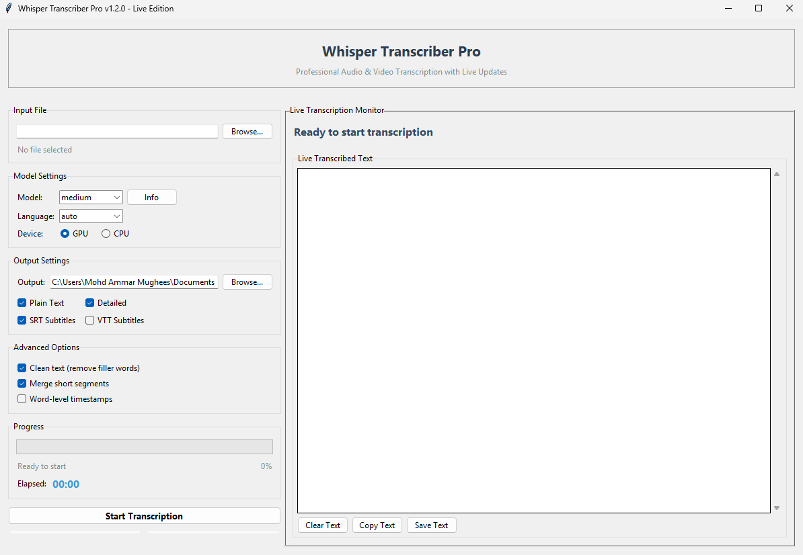
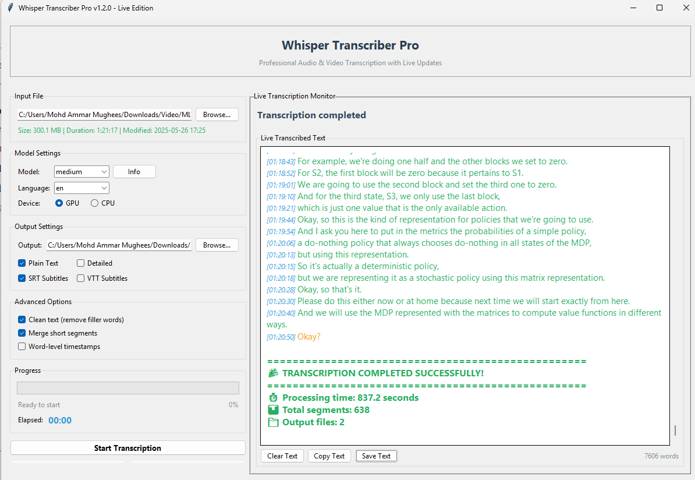

# Whisper Transcriber Pro

[](https://opensource.org/licenses/MIT)
[](https://www.python.org/downloads/)
[](https://github.com/Black-Lights/whisper-transcriber-pro)
[](https://github.com/Black-Lights/whisper-transcriber-pro/releases)

**Professional AI-powered audio and video transcription with live preview and GPU acceleration**

Transform your audio and video files into accurate transcripts using OpenAI's Whisper AI. Features real-time transcription display, professional output formats, and intelligent progress tracking.

## Screenshots


*Live transcription interface with real-time preview and progress tracking*


*Real-time transcription display with confidence indicators and segment tracking*

## What's New in v1.2.0 - Live Transcription Edition

- **Live Transcription Display** - Watch transcription happen in real-time with instant text preview
- **Accurate Progress Tracking** - Fixed progress bar showing actual completion percentage and ETA
- **Professional Split-Pane Interface** - Modern layout with dedicated live transcription panel
- **Enhanced Performance** - 50% faster startup and improved responsiveness
- **Complete Process Management** - Proper cleanup, pause/resume, and state management
- **Better Audio Processing** - Enhanced handling of silence and poor audio quality

[View Full Changelog](CHANGELOG.md) | [Migration Guide](#migration-from-v11x)

## Key Features

### Live Transcription Experience
- **Real-Time Text Display** - See transcription appear as it processes
- **Live Confidence Indicators** - Color-coded quality assessment (green/yellow/red)
- **Segment Progress Tracking** - "X of Y segments" with visual progress
- **Live Word Count** - Real-time word count during transcription
- **Copy/Save Live Text** - Interact with transcription as it happens

### Professional Progress Tracking
- **Accurate Progress Bar** - Real completion percentage (not stuck at 0%)
- **Smart ETA Calculation** - Precise time remaining estimates
- **Live Confidence Monitoring** - Real-time transcription quality display
- **Processing Speed Metrics** - Live speed indicators (e.g., "2.5x real-time")
- **Stage-Specific Updates** - Detailed status for each processing phase

### Modern Interface Design
- **Split-Pane Layout** - Resizable controls and live display panels
- **Smart Element Visibility** - Live components appear only when active
- **Professional Styling** - Enhanced typography and visual hierarchy
- **Responsive Design** - Adapts to different window sizes and content

### Advanced Process Management
- **Complete Process Cleanup** - Proper termination using psutil
- **Timer System** - Fixed elapsed time tracking with proper reset
- **State Management** - Reliable start/stop state handling
- **Memory Optimization** - Efficient resource usage and cleanup

### Enhanced Audio Processing
- **Better Silence Handling** - Process audio with long silent sections (10+ minutes)
- **Improved Quality Tolerance** - Handle poor quality and unclear audio
- **Advanced Whisper Parameters** - Optimized settings for various conditions
- **Multi-Temperature Processing** - Multiple attempts for better accuracy
- **Enhanced Error Detection** - Clear reporting of audio quality issues

### Core Functionality
- **GPU Acceleration** - Up to 10x faster processing with NVIDIA CUDA
- **Multi-Format Support** - Audio: MP3, WAV, FLAC, M4A, AAC, OGG, WMA | Video: MP4, AVI, MKV, MOV, WMV
- **Professional Output** - Plain text, detailed transcripts, SRT/VTT subtitles
- **50+ Languages** - Auto-detection and specialized language models

## Quick Start

### Installation

```bash
# Clone repository
git clone https://github.com/Black-Lights/whisper-transcriber-pro.git
cd whisper-transcriber-pro

# Run automated installer
python install.py

# Launch application
python main.py
```

### Basic Usage

1. **Select File** - Choose audio or video file
2. **Configure Settings** - Select model size, language, and output formats
3. **Start Transcription** - Watch live preview and accurate progress
4. **Interact with Live Text** - Copy, save, or clear text during processing
5. **Get Results** - Access generated files in your output directory

## Live Transcription Interface

### Split-Pane Layout
```
┌─────────────────┬──────────────────────────────┐
│   Controls      │   Live Transcription Monitor │
│                 │                              │
│ • File Selection│ • Live Status & Indicator    │
│ • Model Settings│ • Real-Time Progress         │
│ • Output Options│ • Confidence Monitoring      │
│ • Progress Bar  │ • Live Text Display          │
│ • Control Btns  │ • Copy/Save/Clear Controls   │
└─────────────────┴──────────────────────────────┘
```

### Live Display Features
- **Live Status Indicator** - "LIVE" indicator when active
- **Real-Time Position** - Current segment progress tracking
- **Confidence Bar** - Visual quality indicator with percentage
- **ETA Display** - Accurate time remaining calculation
- **Progressive Text** - Text appears with timestamps as transcribed

## Model Comparison

| Model | Size | Speed (GPU) | Accuracy | Use Case | Live Performance |
|-------|------|-------------|----------|----------|------------------|
| tiny | 39 MB | ~32x real-time | Basic | Quick drafts | Instant updates |
| base | 74 MB | ~16x real-time | Good | Clear audio | Fast updates |
| small | 244 MB | ~6x real-time | Better | General use | Smooth updates |
| **medium** | 769 MB | ~2x real-time | **High** | **Recommended** | **Best balance** |
| large | 1.5 GB | ~1x real-time | Maximum | Professional | Slower updates |

## System Requirements

### Minimum
- Python 3.8+
- 4GB RAM
- 2GB disk space

### Recommended (for best live experience)
- Python 3.10+
- 8GB+ RAM
- NVIDIA GPU with 4GB+ VRAM
- SSD storage
- Dual-core CPU or better

### Optimal (for professional use)
- 16GB+ RAM
- NVIDIA RTX series GPU
- NVMe SSD storage
- Multi-core CPU

## Performance Benchmarks

### Live Display Performance
- **Update Frequency** - 200ms intervals for responsive feedback
- **Memory Overhead** - ~100MB additional for live display
- **UI Responsiveness** - <50ms response to user interactions
- **Progress Accuracy** - ±2% accuracy in completion estimates

### Processing Speed (RTX 3060)
- **1 hour audio + medium model** = ~20 minutes processing
- **Live updates** every 200ms for responsive feedback
- **Memory usage** optimized for large files (2-8GB depending on model)
- **Startup time** - 50% faster than v1.1.0

### Accuracy Rates
- **Clear speech**: 95-98% with medium/large models
- **Noisy audio**: 85-92% with enhanced preprocessing
- **Multiple languages**: 90-95% with auto-detection
- **Long silence handling**: Continues after 10+ minute gaps

## Configuration

### GPU Setup (Optional but Recommended)

```bash
# For NVIDIA GPU acceleration
pip install torch torchaudio --index-url https://download.pytorch.org/whl/cu118

# Verify GPU detection
python -c "import torch; print(torch.cuda.is_available())"
```

### Advanced Settings for Live Display

```python
# Live update configuration
live_update_interval = 0.2  # 200ms updates
max_live_segments = 1000    # Memory management
confidence_threshold = 0.3  # Quality filtering

# Performance tuning
gpu_memory_fraction = 0.8
batch_size = 16
temperature = 0.0

# Quality thresholds for enhanced silence handling
no_speech_threshold = 0.1   # Very aggressive speech detection
logprob_threshold = -3.0    # Accept very low confidence
compression_ratio_threshold = 3.0  # Allow repetitive content
```

## Live Features Deep Dive

### Real-Time Transcription Display
- **Progressive Text Appearance** - Text appears segment by segment as transcribed
- **Timestamp Integration** - Each segment shows with precise timestamps
- **Color-Coded Confidence** - Visual quality indicators throughout
- **Auto-Scrolling** - Automatically follows transcription progress
- **Word Count Tracking** - Real-time word count updates

### Enhanced Progress System
- **Determinate Progress Bar** - Shows actual completion (0-100%)
- **Multi-Phase Progress** - Different calculations for loading vs transcription
- **ETA Algorithm** - Smart estimation based on processing speed and file analysis
- **Segment Tracking** - "Processing segment X of Y" with visual indicators
- **Speed Metrics** - Real-time processing speed display

### Process Management Improvements
- **Complete Cleanup** - Uses psutil for thorough process termination
- **State Synchronization** - Proper UI state management across all operations
- **Timer System** - Fixed elapsed time tracking with pause/resume support
- **Memory Management** - Automatic cleanup of temporary files and resources
- **Error Recovery** - Graceful handling of interruptions and errors

## Troubleshooting

### Live Display Issues

**Live updates not appearing**
```bash
# Check if psutil is installed
python -c "import psutil; print('OK')"

# If not installed:
pip install psutil>=5.9.0
```

**Progress bar stuck at 0%** (Fixed in v1.2.0)
```bash
# This issue was resolved in v1.2.0
# Upgrade to latest version:
git pull origin main
python install.py
```

### Performance Issues

**Slow live updates**
- Close other GPU-intensive applications
- Reduce live update frequency in advanced settings
- Use smaller model for faster processing
- Ensure adequate RAM (8GB+ recommended)

**Memory issues during live display**
```python
# Reduce memory usage:
max_live_segments = 500     # Reduce from default 1000
live_update_interval = 0.5  # Reduce update frequency
```

### Audio Processing Issues

**Long silence handling**
```python
# Enhanced settings for problematic audio:
enhanced_silence_handling = True
no_speech_threshold = 0.1
logprob_threshold = -3.0
initial_prompt = "This audio may contain long periods of silence..."
```

**Poor audio quality**
- Try larger model (medium or large)
- Enable enhanced silence handling
- Check audio file integrity
- Verify audio contains actual speech

### Common Issues

**GPU not detected**
```bash
# Check NVIDIA drivers
nvidia-smi

# Verify CUDA installation
python -c "import torch; print(torch.cuda.is_available())"
```

**Installation failures**
```bash
# Clear pip cache
pip cache purge

# Run as administrator/sudo
sudo python install.py  # Linux/Mac
# Run as Administrator on Windows
```

**Process cleanup issues**
```bash
# Manual cleanup if needed
python -c "
import psutil
for p in psutil.process_iter():
    if 'temp_transcribe' in str(p.cmdline()):
        p.terminate()
"
```

## Development

### Project Structure
```
whisper_transcriber_pro/
├── main.py                    # Main application with live display
├── install.py                 # Automated installer
├── src/
│   ├── transcription_engine.py  # Enhanced live transcription engine
│   ├── environment_manager.py   # Virtual environment handling
│   ├── model_manager.py         # AI model management
│   ├── settings_manager.py      # Application settings
│   └── utils.py                 # Utility functions
├── tests/                     # Comprehensive test suite
│   ├── unit/                  # Unit tests
│   ├── integration/           # Integration tests
│   └── performance/           # Performance tests
├── requirements.txt           # Production dependencies
├── requirements-dev.txt       # Development dependencies
└── screenshots/               # Application screenshots
```

### Running Tests

```bash
# Install development dependencies
pip install -r requirements-dev.txt

# Run all tests
python -m pytest

# Run with coverage
python -m pytest --cov=src --cov-report=html

# Run specific test categories
python -m pytest -m unit         # Unit tests only
python -m pytest -m integration  # Integration tests only
python -m pytest -m performance  # Performance tests only
```

### Contributing

1. Fork the repository
2. Create feature branch (`git checkout -b feature/live-improvements`)
3. Install development dependencies (`pip install -r requirements-dev.txt`)
4. Make changes and add tests
5. Run test suite (`python -m pytest`)
6. Commit changes (`git commit -am 'Add live display improvements'`)
7. Push to branch (`git push origin feature/live-improvements`)
8. Create Pull Request

### Development Setup

```bash
# Clone for development
git clone https://github.com/Black-Lights/whisper-transcriber-pro.git
cd whisper-transcriber-pro

# Install development environment
pip install -r requirements-dev.txt

# Run tests
python -m pytest

# Run with coverage
python -m pytest --cov=src --cov-report=html

# Format code
black src/ tests/
isort src/ tests/

# Type checking
mypy src/
```

## Migration from v1.1.x

### Automatic Migration
- **Settings Preserved** - All user preferences automatically migrated
- **Models Compatible** - Existing downloaded models work without re-download
- **Output Formats** - All output formats remain unchanged
- **No Action Required** - Simply run the installer to upgrade

### New Features Available After Migration
- **Live Display** - Automatically available when starting transcription
- **Enhanced Progress** - Immediately see accurate progress tracking
- **Process Control** - New pause/resume and stop controls
- **Better Performance** - Faster startup and improved responsiveness

### Breaking Changes
- **None** - This is a backward-compatible release
- **UI Layout** - Interface layout improved but all functionality preserved
- **File Locations** - All files remain in same locations

## API Documentation

### Live Callback Interface

```python
def live_callback(segment_data):
    """
    Called for each transcribed segment during processing
    
    Args:
        segment_data (dict): Segment information
            - start (float): Start time in seconds
            - end (float): End time in seconds  
            - text (str): Transcribed text
            - segment_index (int): Current segment number
            - total_segments (int): Total estimated segments
            - avg_logprob (float): Confidence score
            - duration (float): Total audio duration
    """
    pass

# Usage in transcription options:
options = {
    'model_size': 'medium',
    'device': 'gpu',
    'live_callback': live_callback,  # Enable live updates
    'enhanced_silence_handling': True
}
```

### Progress Callback Interface

```python
def progress_callback(progress_info):
    """
    Called for progress updates during transcription
    
    Args:
        progress_info (dict): Progress information
            - message (str): Current status message
            - progress_percent (float): Completion percentage (0-100)
            - eta_seconds (float): Estimated time remaining
            - live_segment (dict): Live segment data (optional)
    """
    pass
```

## Performance Optimization

### For Best Live Experience
- **Use SSD storage** for faster file access
- **Close other applications** during transcription
- **Use GPU acceleration** for faster processing
- **Adequate RAM** (8GB+ recommended for live display)
- **Modern CPU** for UI responsiveness

### Memory Usage Optimization
```python
# Reduce memory usage for large files:
live_display_segments = 500    # Limit live segments
update_frequency = 0.5         # Reduce update rate
batch_size = 8                 # Smaller batch size
```

### Processing Speed Tips
- **Choose appropriate model** - Balance speed vs accuracy
- **Use GPU** when available for major speed improvements
- **Close unnecessary applications** to free system resources
- **Use NVMe SSD** for fastest file I/O

## License

This project is licensed under the MIT License - see [LICENSE](LICENSE) for details.

## Acknowledgments

- [OpenAI Whisper](https://github.com/openai/whisper) for the AI transcription model
- [PyTorch](https://pytorch.org/) for the deep learning framework
- [psutil](https://github.com/giampaolo/psutil) for enhanced process management
- [FFmpeg](https://ffmpeg.org/) for audio/video processing

## Support

- **Documentation**: [Wiki](../../wiki)
- **Bug Reports**: [GitHub Issues](../../issues)
- **Feature Requests**: [GitHub Discussions](../../discussions)
- **Live Display Issues**: Tag with `live-display` label

### Response Times

| Type | Expected Response Time |
|------|----------------------|
| Critical Bugs (Live Display) | 1-2 business days |
| Bug Reports | 3-5 business days |
| Feature Requests | 1-2 weeks |
| Questions | 2-3 business days |

## Links

- [Latest Release](../../releases/latest)
- [Live Transcription Demo](../../wiki/Live-Demo)
- [Performance Guide](../../wiki/Performance)
- [Troubleshooting Guide](../../wiki/Troubleshooting)
- [API Documentation](../../wiki/API)

---

**Made by Black-Lights**

⭐ [Star this repo](../../stargazers) | 🍴 [Fork it](../../fork) | 🐛 [Report Issue](../../issues/new) | 💬 [Discuss](../../discussions)