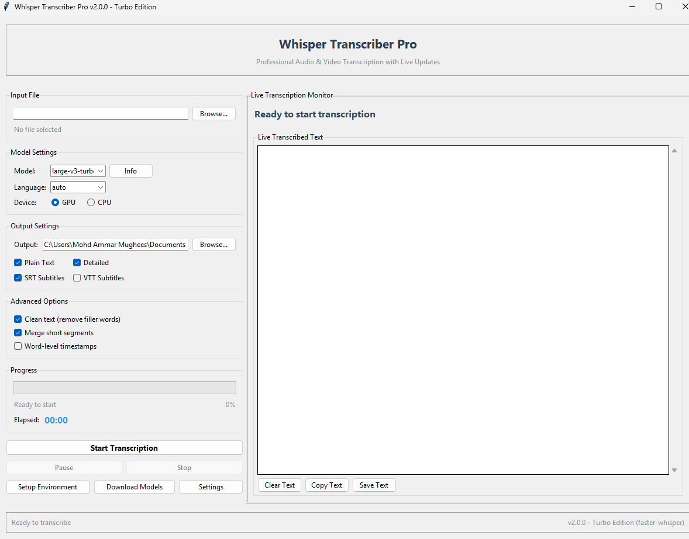

# Whisper Transcriber Pro

[](https://opensource.org/licenses/MIT)
[](https://www.python.org/downloads/)
[](https://github.com/Black-Lights/whisper-transcriber-pro)
[](https://github.com/Black-Lights/whisper-transcriber-pro/releases)

**Professional AI-powered audio and video transcription with live preview and GPU acceleration**

Transform your audio and video files into accurate transcripts using faster-whisper (CTranslate2) with batched GPU inference. Features real-time transcription display, professional output formats, and up to 50x faster processing than the original Whisper.

## Screenshots


*Turbo Edition interface with faster-whisper engine and large-v3-turbo model*

## What's New in v2.0.0 - Turbo Edition

- **10-50x Faster Transcription** - Switched from openai-whisper to faster-whisper (CTranslate2 backend)
- **Batched GPU Inference** - Process multiple audio chunks simultaneously for maximum throughput
- **New Default Model: large-v3-turbo** - Better accuracy than medium at similar speed (~7.75% WER)
- **INT8 Quantization** - Runs on GPUs with just 6GB VRAM (e.g., RTX 3060)
- **Silero VAD Filtering** - Automatically skips silent portions, reducing processing time
- **True Live Streaming** - Segments appear during transcription, not after (generator-based)
- **No More Hallucinations** - Greedy decoding eliminates repetitive text artifacts
- **Zero Post-Processing Delay** - Removed 0.1s/segment sleep (saved 72s on 724 segments)

### First Run Note

The first transcription will download the large-v3-turbo model (~1.6 GB) from HuggingFace. This is a one-time download. Subsequent runs will load the cached model in seconds.

[View Full Changelog](CHANGELOG.md) | [Migration Guide](#migration-from-v12x)

## Key Features

### Turbo Performance Engine
- **faster-whisper Backend** - CTranslate2 optimized inference engine (4-8x faster than PyTorch)
- **Batched GPU Inference** - `BatchedInferencePipeline` processes multiple chunks in parallel
- **INT8 Quantization** - Minimal VRAM usage (~1.5 GB for large-v3-turbo) with no quality loss
- **Silero VAD v6** - Built-in voice activity detection skips silence automatically
- **Greedy Decoding** - beam_size=1, best_of=1 for maximum speed with negligible quality difference

### Live Transcription Experience
- **True Real-Time Streaming** - Segments appear as they are transcribed (generator-based, not post-loop)
- **Live Confidence Indicators** - Color-coded quality assessment (green/yellow/red)
- **Time-Based Progress** - Progress calculated from segment timestamps vs audio duration
- **Live Word Count** - Real-time word count during transcription
- **Copy/Save Live Text** - Interact with transcription as it happens

### Professional Output
- **Multiple Formats** - Plain text, detailed transcripts, SRT/VTT subtitles
- **Better Accuracy** - large-v3-turbo has lower WER than medium model
- **50+ Languages** - Auto-detection and specialized language models
- **Clean Text** - Automatic filler word removal and formatting

### Core Functionality
- **GPU Acceleration** - Up to 100x real-time with batched CUDA inference
- **Multi-Format Support** - Audio: MP3, WAV, FLAC, M4A, AAC, OGG, WMA | Video: MP4, AVI, MKV, MOV, WMV
- **7 Model Options** - tiny, base, small, medium, large-v3, large-v3-turbo, distil-large-v3
- **Advanced Settings** - Configurable beam_size, batch_size, VAD, compute_type via settings

## Quick Start

### Installation

```bash
# Clone repository
git clone https://github.com/Black-Lights/whisper-transcriber-pro.git
cd whisper-transcriber-pro

# Run automated installer
python install.py

# Launch application
python main.py
```

### Installation Note

**The initial setup will take some time** as it downloads:
- faster-whisper + CTranslate2 (~200 MB)
- Additional dependencies

**First transcription** will download the large-v3-turbo model (~1.6 GB) from HuggingFace. This is a one-time download -- subsequent runs will load the cached model in seconds.

**Total first-run download: ~2 GB**
Setup time depends on your internet speed (typically 5-10 minutes).


### Alternative Installation

If you prefer manual installation:

```bash
# Create and activate virtual environment (recommended)
python -m venv whisper-env
source whisper-env/bin/activate  # On Windows: whisper-env\Scripts\activate

# Install dependencies
pip install -r requirements.txt

# Run application
python main.py
```

**Note:** Always use a virtual environment to avoid dependency conflicts.  
The application will automatically download required models on first run.

### Basic Usage

1. **Select File** - Choose audio or video file
2. **Configure Settings** - Select model size, language, and output formats
3. **Start Transcription** - Watch live preview and accurate progress
4. **Interact with Live Text** - Copy, save, or clear text during processing
5. **Get Results** - Access generated files in your output directory

## Live Transcription Interface

### Split-Pane Layout
```
┌─────────────────┬──────────────────────────────┐
│   Controls      │   Live Transcription Monitor │
│                 │                              │
│ • File Selection│ • Live Status & Indicator    │
│ • Model Settings│ • Real-Time Progress         │
│ • Output Options│ • Confidence Monitoring      │
│ • Progress Bar  │ • Live Text Display          │
│ • Control Btns  │ • Copy/Save/Clear Controls   │
└─────────────────┴──────────────────────────────┘
```

### Live Display Features
- **Live Status Indicator** - "LIVE" indicator when active
- **Real-Time Position** - Current segment progress tracking
- **Confidence Bar** - Visual quality indicator with percentage
- **ETA Display** - Accurate time remaining calculation
- **Progressive Text** - Text appears with timestamps as transcribed

## Model Comparison

| Model | Size | Speed (GPU Batched) | WER | VRAM | Use Case |
|-------|------|---------------------|-----|------|----------|
| tiny | 75 MB | ~100x real-time | ~15% | <1 GB | Quick drafts |
| base | 145 MB | ~80x real-time | ~12% | ~1 GB | Clear audio |
| small | 488 MB | ~60x real-time | ~10% | ~2 GB | General use |
| medium | 1.5 GB | ~40x real-time | ~8.5% | ~5 GB | High accuracy |
| **large-v3-turbo** | **1.6 GB** | **~60x real-time** | **7.75%** | **~6 GB** | **Recommended** |
| large-v3 | 3.1 GB | ~20x real-time | 7.4% | ~10 GB | Maximum accuracy |
| distil-large-v3 | 1.5 GB | ~70x real-time | ~7.5% | ~5 GB | Fast + accurate |

## System Requirements

### Minimum
- Python 3.8+
- 4GB RAM
- 2GB disk space

### Recommended (for best live experience)
- Python 3.10+
- 8GB+ RAM
- NVIDIA GPU with 4GB+ VRAM
- SSD storage
- Dual-core CPU or better

### Optimal (for professional use)
- 16GB+ RAM
- NVIDIA RTX series GPU
- NVMe SSD storage
- Multi-core CPU

## Performance Benchmarks

### v2.0 vs v1.2 Comparison (RTX 3060, 6GB VRAM)

| Metric | v1.2 (openai-whisper) | v2.0 (faster-whisper) |
|--------|----------------------|----------------------|
| **1-hour audio** | ~24 minutes | ~1-2 minutes |
| **Model** | medium (769 MB) | large-v3-turbo (1.6 GB) |
| **Accuracy (WER)** | ~8.5% | ~7.75% |
| **VRAM Usage** | ~5 GB | ~1.5 GB (INT8) |
| **Hallucinations** | Yes (repetitive text) | None (greedy decoding) |
| **Live Updates** | After transcription | During transcription |
| **VAD Filtering** | None | Silero VAD v6 |

### Processing Speed (RTX 3060, 6GB VRAM)
- **1 hour audio + large-v3-turbo** = ~1-2 minutes (vs ~24 min with v1.2)
- **Live segment streaming** during transcription (not after)
- **VRAM usage**: ~1.5 GB with INT8 quantization
- **First run**: Add ~5-10 min for one-time model download (~1.6 GB)

### Accuracy Rates
- **Clear speech**: 95-98% with large-v3-turbo/large-v3
- **Noisy audio**: 85-92% with VAD filtering + enhanced silence handling
- **Multiple languages**: 90-95% with auto-detection
- **Technical terms**: Significantly improved (NDVI, TerraTorch, UNET correctly transcribed)

## Configuration

### GPU Setup (Optional but Recommended)

faster-whisper handles CUDA automatically via CTranslate2. No separate PyTorch CUDA installation needed.

```bash
# Verify GPU is detected
nvidia-smi

# faster-whisper will use CUDA automatically if available
```

### Advanced Settings

The following settings can be configured in `settings.json` under `"advanced"`:

```python
# Performance tuning (v2.0 defaults - optimized for speed)
beam_size = 1           # Greedy decoding (fastest)
best_of = 1             # Single candidate
temperature = 0.0       # No random sampling
batch_size = 8          # GPU batch size (increase for more VRAM)
compute_type = "int8"   # INT8 quantization (minimal VRAM)
vad_filter = True       # Skip silence automatically

# Quality tuning (trade speed for accuracy)
no_speech_threshold = 0.3   # Speech detection sensitivity
logprob_threshold = -1.0    # Confidence threshold
```

## Live Features Deep Dive

### Real-Time Transcription Display
- **Progressive Text Appearance** - Text appears segment by segment as transcribed
- **Timestamp Integration** - Each segment shows with precise timestamps
- **Color-Coded Confidence** - Visual quality indicators throughout
- **Auto-Scrolling** - Automatically follows transcription progress
- **Word Count Tracking** - Real-time word count updates

### Enhanced Progress System
- **Determinate Progress Bar** - Shows actual completion (0-100%)
- **Multi-Phase Progress** - Different calculations for loading vs transcription
- **ETA Algorithm** - Smart estimation based on processing speed and file analysis
- **Segment Tracking** - "Processing segment X of Y" with visual indicators
- **Speed Metrics** - Real-time processing speed display

### Process Management Improvements
- **Complete Cleanup** - Uses psutil for thorough process termination
- **State Synchronization** - Proper UI state management across all operations
- **Timer System** - Fixed elapsed time tracking with pause/resume support
- **Memory Management** - Automatic cleanup of temporary files and resources
- **Error Recovery** - Graceful handling of interruptions and errors

## Troubleshooting

### Live Display Issues

**Live updates not appearing**
```bash
# Check if psutil is installed
python -c "import psutil; print('OK')"

# If not installed:
pip install psutil>=5.9.0
```

**Progress bar stuck at 0%** (Fixed in v1.2.0)
```bash
# This issue was resolved in v1.2.0
# Upgrade to latest version:
git pull origin main
python install.py
```

### Performance Issues

**Slow live updates**
- Close other GPU-intensive applications
- Reduce live update frequency in advanced settings
- Use smaller model for faster processing
- Ensure adequate RAM (8GB+ recommended)

**Memory issues during live display**
```python
# Reduce memory usage:
max_live_segments = 500     # Reduce from default 1000
live_update_interval = 0.5  # Reduce update frequency
```

### Audio Processing Issues

**Long silence handling**
```python
# Enhanced settings for problematic audio:
enhanced_silence_handling = True
no_speech_threshold = 0.1
logprob_threshold = -3.0
initial_prompt = "This audio may contain long periods of silence..."
```

**Poor audio quality**
- Try larger model (medium or large)
- Enable enhanced silence handling
- Check audio file integrity
- Verify audio contains actual speech

### Common Issues

**GPU not detected**
```bash
# Check NVIDIA drivers
nvidia-smi

# Verify CUDA installation
python -c "import torch; print(torch.cuda.is_available())"
```

**Installation failures**
```bash
# Clear pip cache
pip cache purge

# Run as administrator/sudo
sudo python install.py  # Linux/Mac
# Run as Administrator on Windows
```

**Process cleanup issues**
```bash
# Manual cleanup if needed
python -c "
import psutil
for p in psutil.process_iter():
    if 'temp_transcribe' in str(p.cmdline()):
        p.terminate()
"
```

## Development

### Project Structure
```
whisper_transcriber_pro/
├── main.py                    # Main application with live display
├── install.py                 # Automated installer
├── src/
│   ├── transcription_engine.py  # Enhanced live transcription engine
│   ├── environment_manager.py   # Virtual environment handling
│   ├── model_manager.py         # AI model management
│   ├── settings_manager.py      # Application settings
│   └── utils.py                 # Utility functions
├── tests/                     # Comprehensive test suite
│   ├── unit/                  # Unit tests
│   ├── integration/           # Integration tests
│   └── performance/           # Performance tests
├── requirements.txt           # Production dependencies
├── requirements-dev.txt       # Development dependencies
└── screenshots/               # Application screenshots
```

### Running Tests

```bash
# Install development dependencies
pip install -r requirements-dev.txt

# Run all tests
python -m pytest

# Run with coverage
python -m pytest --cov=src --cov-report=html

# Run specific test categories
python -m pytest -m unit         # Unit tests only
python -m pytest -m integration  # Integration tests only
python -m pytest -m performance  # Performance tests only
```

### Contributing

1. Fork the repository
2. Create feature branch (`git checkout -b feature/live-improvements`)
3. Install development dependencies (`pip install -r requirements-dev.txt`)
4. Make changes and add tests
5. Run test suite (`python -m pytest`)
6. Commit changes (`git commit -am 'Add live display improvements'`)
7. Push to branch (`git push origin feature/live-improvements`)
8. Create Pull Request

### Development Setup

```bash
# Clone for development
git clone https://github.com/Black-Lights/whisper-transcriber-pro.git
cd whisper-transcriber-pro

# Install development environment
pip install -r requirements-dev.txt

# Run tests
python -m pytest

# Run with coverage
python -m pytest --cov=src --cov-report=html

# Format code
black src/ tests/
isort src/ tests/

# Type checking
mypy src/
```

## Migration from v1.2.x

### What Changes
- **Engine**: openai-whisper replaced with faster-whisper (CTranslate2)
- **Models**: New CTranslate2 format models downloaded from HuggingFace (old .pt models no longer used)
- **Default Model**: Changed from `medium` to `large-v3-turbo` (faster AND more accurate)
- **Settings**: New advanced options (vad_filter, compute_type, batch_size)

### Migration Steps
1. Run `Setup Environment` in the app to install faster-whisper
2. First transcription will auto-download the large-v3-turbo model (~1.6 GB)
3. Old openai-whisper models in `~/.cache/whisper/` can be safely deleted

### Output Compatibility
- All output formats (TXT, SRT, VTT, detailed) remain identical
- Settings file is backward-compatible (new defaults merged automatically)

## API Documentation

### Live Callback Interface

```python
def live_callback(segment_data):
    """
    Called for each transcribed segment during processing

    Args:
        segment_data (dict): Segment information
            - start (float): Start time in seconds
            - end (float): End time in seconds
            - text (str): Transcribed text
            - segment_index (int): Current segment number
            - total_segments (int): Total estimated segments
            - avg_logprob (float): Confidence score
            - duration (float): Total audio duration
    """
    pass

# Usage in transcription options:
options = {
    'model_size': 'medium',
    'device': 'gpu',
    'live_callback': live_callback,  # Enable live updates
    'enhanced_silence_handling': True
}
```

### Progress Callback Interface

```python
def progress_callback(progress_info):
    """
    Called for progress updates during transcription

    Args:
        progress_info (dict): Progress information
            - message (str): Current status message
            - progress_percent (float): Completion percentage (0-100)
            - eta_seconds (float): Estimated time remaining
            - live_segment (dict): Live segment data (optional)
    """
    pass
```

## Performance Optimization

### For Best Live Experience
- **Use SSD storage** for faster file access
- **Close other applications** during transcription
- **Use GPU acceleration** for faster processing
- **Adequate RAM** (8GB+ recommended for live display)
- **Modern CPU** for UI responsiveness

### Memory Usage Optimization
```python
# Reduce memory usage for large files:
live_display_segments = 500    # Limit live segments
update_frequency = 0.5         # Reduce update rate
batch_size = 8                 # Smaller batch size
```

### Processing Speed Tips
- **Choose appropriate model** - Balance speed vs accuracy
- **Use GPU** when available for major speed improvements
- **Close unnecessary applications** to free system resources
- **Use NVMe SSD** for fastest file I/O

## License

This project is licensed under the MIT License - see [LICENSE](LICENSE) for details.

## Acknowledgments

- [faster-whisper](https://github.com/SYSTRAN/faster-whisper) for the CTranslate2-based Whisper inference engine
- [OpenAI Whisper](https://github.com/openai/whisper) for the original AI transcription model
- [CTranslate2](https://github.com/OpenNMT/CTranslate2) for optimized transformer inference
- [psutil](https://github.com/giampaolo/psutil) for enhanced process management
- [FFmpeg](https://ffmpeg.org/) for audio/video processing

## Support

- **Documentation**: [Wiki](../../wiki)
- **Bug Reports**: [GitHub Issues](../../issues)
- **Feature Requests**: [GitHub Discussions](../../discussions)
- **Live Display Issues**: Tag with `live-display` label

### Response Times

| Type | Expected Response Time |
|------|----------------------|
| Critical Bugs (Live Display) | 1-2 business days |
| Bug Reports | 3-5 business days |
| Feature Requests | 1-2 weeks |
| Questions | 2-3 business days |

## Links

- [Latest Release](../../releases/latest)
- [Live Transcription Demo](../../wiki/Live-Demo)
- [Performance Guide](../../wiki/Performance)
- [Troubleshooting Guide](../../wiki/Troubleshooting)
- [API Documentation](../../wiki/API)

---

**Made by Black-Lights**

⭐ [Star this repo](../../stargazers) | 🍴 [Fork it](../../fork) | 🐛 [Report Issue](../../issues/new) | 💬 [Discuss](../../discussions)
